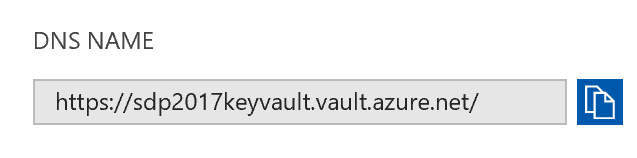

# Lab 6 - Security

During this lab you will look at a specific security related aspect for containers: secrets in configuration. There is a lot more to be said and done about security  for containers though. Your focus will be to remove all secrets from configuration files and into secure stores for development and production.

Goals for this lab:
- [Add support for Azure Key Vault to store secrets](#keyvault)
- [Store user secrets during development](#usersecrets)
- [Use Docker Secrets to store Key Vault credentials (experimental)](#dockersecrets)

## Secrets and Docker

You must have noticed that the connection string to the database contains a username and password. The connection string is set in an environment variable that is stored in the `docker-compose.yml` and `docker-compose.azure.yml` file . Even though this file is only relevant during startup when the environment variables are set on containers, these secrets inside running containers are easily accessible when you have access to the host.

Open a Docker CLI and find a running container on your host. This can be your development machine or the Docker cluster from the previous lab. Run one of the following command depending on your choice:

```
docker ps                           -- Single host
docker services ls retrogaming      -- Cluster
```
Pick any running container, but preferably the web API which actually contains the connection string in an environment variable. Use its container ID to inspect it. You should find the `Env` section that contains all variables for the current environment.
```
"Env": [
  "ASPNETCORE_ENVIRONMENT=Development",
  "ASPNETCORE_URLS=http://0.0.0.0:1337",
  "ConnectionStrings:LeaderboardContext=Server=sqldata;
    Database=LeaderboardNETCore;User Id=sa;Password=Pass@word;
    Trusted_Connection=False"
],
```

You can also look at the history of images and see the various commands that were used to build them. Try running:
```
docker history microsoft/mssql-server-linux
docker history microsoft/mssql-server-linux --no-trunc
```
Docker containers and their images are inspectable and it is non-trivial to work with secrets in a secure way. Let's find out how to do that.

## <a name='keyvault'></a>Adding support for Azure Key Vault

You can use Azure Key Vault to store sensitive information, such as  connections, certificates or accounts, in keys, secrets and certificates.

Visit the [Azure Portal](https://portal.azure.com) and create a Key Vault resource in your resource group. Ideally you would place the KeyVault in a separate resource group, as its lifetime should be surpassing that of the container cluster's group. It needs to have a unique name. Take note of the DNS name of the Key Vault in the `Properties` section.



Next, allow the Web API access to the Key Vault. Register the web API as an Azure Active Directory application. Go to the Azure Active Directory for your Azure subscription and choose `App Registrations`. Create a new application registration called `Leaderboard Web API` of type `Web app / API` and use the local URL `http://localhost:1337` as the Sign-on URL value.


This Azure AD application registration represents a service principal that you are going to give access to the Azure Key Vault. Store the application ID of the application that is displayed in the `Essentials` section.


Allow the Web API service principal to access the Key Vault. For that you need a Client ID and Secret. The Client ID is the application ID you stored earlier. The secret is a key you have to create under the application registration. Go to the `Keys` section and create a password. Give it `KeyVaultSecret` as a name. Set its expiration date to a year and save it. Make sure you copy and store the value that is generated. It should resemble the following format:
```
vFwBC9rEtBfO7BNVgeYmSLcpxhTGQfqKG4/ZAoCKhjh=
```

Navigate to the `Access policies` under your Key Vault blade. Create a new access policy by clicking `Add new` and selecting the `Leaderboard Web API` as the principal. Give it Key and Secret permissions to `Get` and `List`.

This should give you a list of values for the following :

Name | Value (example)
--- | ---
Key Vault name | https://sdp2017keyvault.vault.azure.net/
Application ID | 1f31d60b-2f81-42c6-9df6-eb636bd3e9d3
Client Secret | vFwBC9rEtBfO7BNVgeYmSLcpxhTGQfqKG4/ZAoCKhjh=

with your specific values.

## Use Key Vault values in .NET Core

The configuration system of .NET Core makes it relatively easy to access Key Vault values as part of your configuration. 

Open the `Leaderboard.WebAPI` project and add three key/value pairs to the `appsettings.json` file, replacing the values with your own.

```
"KeyVaultName": "https://sdp2017keyvault.vault.azure.net/",
"KeyVaultClientID": "1f31d60b-2f81-42c6-9df6-eb636bd3e9d3",
"KeyVaultClientSecret": "vFwBC9rEtBfO7BNVgeYmSLcpxhTGQfqKG4/ZAoCKhjh=",
```

Add code to the `Startup` class's constructor to add the Azure Key Vault into the configuration system.

```
builder.AddAzureKeyVault(
    Configuration["KeyVaultName"],
    Configuration["KeyVaultClientID"],
    Configuration["KeyVaultClientSecret"]
);
Configuration = builder.Build();
```

At this point you are ready to store the connection string in the Key Vault. Open the blade for the Key Vault and go to `Secrets`. Add a new secret with the name `ConnectionStrings--LeaderboardContext`. The value is the connection string for the SQL Server instance in your container or the Azure SQL Database.
The double-dash is a convention to indicate a section. In this format it will surface as a connection string just like before.

Run your web API separately by clicking `Debug, Start new instance` from the right-click context menu of the project. Add a breakpoint in the ConfigureServices method and check whether the connection string is read correctly. If all is well, run the composition locally.

## <a name='usersecrets'></a> Using User Secrets

Now that all secrets are safely stored in the Key Vault you are one step closer to managing the sensitive configuration information of your Docker solution.

You must have noticed how there is still a set of secrets present in the solution. This must be remediated, as these secrets allow access to the Key Vault and enable anyone to retrieve all keys and secrets from the vault.

First, let's store the Key Vault access information in a safe place during development on your machine. Right-click the Web API project and choose `Manage User Secrets` from the context menu. It will open a JSON file called `secrets.json` that is not added to the project. Instead it exists on the file system in a special location `%AppData%\Roaming\Microsoft\UserSecrets\<UserSecretsId>\secrets.json`. Find the location of this file and verify that the `UserSecretsId` corresponds to the new entry in the `.csproj` file of the Web API project.

Cut the values for the Key Vault connection from the `appsettings.json` file and add these to the `secrets.json` file. Save the file and go to the `Startup` class. 
Add the code below in the constructor to add user secrets to the configuration system of .NET Core.
```
  .AddEnvironmentVariables(); // Existing code

  if (env.IsDevelopment())
  {
    builder.AddUserSecrets<Startup>(true);
  }
  Configuration = builder.Build();
```

Check if the user secrets are used when running the Web API outside of a container again. When it does, try running it in the complete composition. You should find that it does not. Think about why it does not work anymore when run from a container.

To fix the issue of the user secrets not being available in the container, you need to add an environment variable to your `docker-compose.override.yml` file for the `USER_SECRETS_ID`.

```
- USER_SECRETS_ID=<your_user_secrets_id>
```
Additionally, you need to give the container access to the local file system to be able to read the `secrets.json` file. You can mount a volume to the container that maps the user secrets folder into the container.

```
volumes:
  - $HOME/.microsoft/usersecrets/$USER_SECRETS_ID:/root/.microsoft/usersecrets/$USER_SECRETS_ID
  - $APPDATA/Microsoft/UserSecrets/$USER_SECRETS_ID:/root/.microsoft/usersecrets/$USER_SECRETS_ID
```
You need only one of the two entries for the volumes. The entry mapping `$HOME` is for Linux OS, and the `$APPDATA` entry for a Windows OS based development machine.

Using user secrets is well suited for development scenarios and single host machine. When running in a cluster for production scenarios it is not recommended. Instead you can use Docker Secrets to add secrets to your cluster host machines. 

## <a name='dockersecrets'></a>(Optional) Using Docker Secrets

> ##### Experimental status
> Be aware that this part of the lab uses unreleased code. The results might not always be successful. Do not spend too much time on this part if it does not work. On the other hand: do not give up too easily.

You can store the secrets in a secure way in your cluster. The way this is done depends on the type of orchestrator you have. For Docker Swarm Mode clusters it uses Docker Secrets. In this final step you are going to create three secrets for the Azure Key Vault connection details, so all secrets are securely stored in a combination of the cluster and the Azure Key Vault. 
Open a Docker CLI and connect to your cluster. Run the following commands:
```
docker secret ls
echo "https://sdp2017keyvault.vault.azure.net/" | docker secret create KeyVaultName -
echo "1f31d60b-2f81-42c6-9df6-eb636bd3e9d3" | docker secret create KeyVaultClientID -
echo "vFwBC9rEtBfO7BNVgeYmSLcpxhTGQfqKG4/ZAoCKhjh=" | docker secret create KeyVaultClientSecret -
docker secret ls
```

Again, you have to replace the values after the `echo` with your specific values. You should see three secrets listed once you have executed these commands.

Edit the constructor of the `Startup` class and include the following code:
```
if (env.IsProduction())
{
  builder.AddDockerSecrets();
}
```
right before the first call to `builder.Build()`

In the `docker-stack.azure.yml` file you must include a new `secrets` section at the root level. Since you created the secrets from the Docker CLI it is considered external to the composition. You indicate this with the external attribute.

```
secrets:
  KeyVaultName:
    external: true
  KeyVaultClientID:
    external: true 
  KeyVaultClientSecret:
    external: true 
```

Inside the service for `leaderboardwebapi` of the `docker-stack.azure.yml` file refer to the secrets by adding 
```
    secrets:
     - KeyVaultName
     - KeyVaultClientID
     - KeyVaultClientSecret
```

## Wrapup

In this lab you have stored the secrets of your application in the Azure Key Vault. You also moved the remaining secrets, containing the details to get access to the vault, in user secrets for development scenarios. In production these secrets would be stored as Docker secrets. Support for .NET Core is still under development.

Continue with [Lab 7 - VSTS Pipelines](Lab7-VSTSPipelines.md).